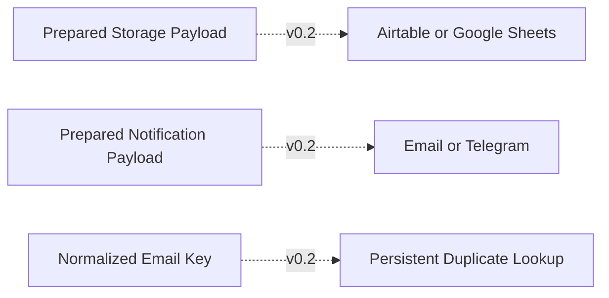

# Architecture

## Purpose

Define the proposed n8n workflow, data contracts, environment boundaries, reliability controls, and future integration points. This is a design only; no workflow has been created.

## Environment Design

| Environment | v0.1 status | Workflow name | Data | Credentials |
|---|---|---|---|---|
| DEV | Planned, inactive | `DEV - Demo Sales Company - Lead Qualification Practice` | Dummy only | None |
| STAGING | Not used | Not applicable | None | None |
| PROD | Not used | Not applicable | None | None |

## Proposed Workflow Architecture

```mermaid
flowchart LR
    A["Manual Trigger"] --> B["Set Sample Lead"]
    B --> C["Normalize Input"]
    C --> D["Validate Required Fields"]
    D --> E["Calculate Lead Score"]
    E --> F["Assign Qualification Status"]
    F --> G["Prepare Storage Record"]
    G --> H["Prepare Internal Notification"]
    H --> I["Final Output"]
```



The following is explicitly deferred to v0.2 and is not part of the v0.1 graph:



## Node Responsibilities

| Order | Node | Proposed type | Responsibility | Failure behavior |
|---|---|---|---|---|
| 1 | Manual Trigger | Manual Trigger | Start controlled DEV execution. | No automatic retry. |
| 2 | Set Sample Lead | Edit Fields (Set) | Supply one complete dummy fixture using the approved input contract. | Stop only for an unexpected node exception. |
| 3 | Normalize Input | Code | Normalize approved strings, enums, email, and UTC timestamp; generate warnings, `lead_id`, and `idempotency_key`. | Preserve invalid values for validation; do not coerce types. |
| 4 | Validate Required Fields | Code | Apply every required-field, type, format, enum, range, consent, and timestamp rule. | Continue with complete invalid context. |
| 5 | Calculate Lead Score | Code | Score valid leads and emit exact reason codes; invalid leads receive `null`. | Unexpected exception stops the DEV execution. |
| 6 | Assign Qualification Status | Code | Assign status, queue, assignment reason, and human-review flag. | Unsupported routing uses General Sales Queue and human review. |
| 7 | Prepare Storage Record | Edit Fields or Code | Create a destination-neutral `prepare_only` payload. | `write_requested` is always `false`. |
| 8 | Prepare Internal Notification | Edit Fields or Code | Create a plain-text `prepare_only` payload. | `send_requested` is always `false`. |
| 9 | Final Output | Edit Fields | Return one consolidated audit object. | Do not claim downstream success. |

## Data Flow

| Stage | Key output |
|---|---|
| Normalized | Canonical input fields, `lead_id`, `idempotency_key`, and `normalization_warnings` |
| Validated | `validation_status` and `validation_errors` |
| Scored | `score` and five reason codes, or `null` plus invalid-input reason |
| Classified | `qualification_status`, `assigned_queue`, `assignment_reason`, and `needs_human_review` |
| Storage-ready | Destination-neutral record with `operation: prepare_only` and `write_requested: false` |
| Notification-ready | Plain-text object with `operation: prepare_only` and `send_requested: false` |
| Final | The exact final output contract below |

## Final Output Contract

Required top-level keys and types:

| Key | Type |
|---|---|
| `lead_id` | string |
| `idempotency_key` | string |
| `normalized_lead` | object containing every approved input field |
| `validation_status` | `valid` or `invalid` |
| `validation_errors` | array of `{field, code, message}` |
| `normalization_warnings` | array of `{field, code}` |
| `score` | number from 0–100 for valid leads; `null` for invalid |
| `score_reasons` | array of machine-readable strings |
| `qualification_status` | `qualified`, `nurture`, `unqualified`, or `invalid` |
| `assigned_queue` | approved queue string |
| `assignment_reason` | machine-readable string |
| `needs_human_review` | Boolean |
| `storage_payload` | object |
| `notification_payload` | object |
| `processed_at` | canonical ISO-8601 UTC string |
| `workflow_version` | `v0.1.0` |

```json
{
  "lead_id": "DEV-alex.rivera@acme.example-20260723T120000Z",
  "idempotency_key": "email:alex.rivera@acme.example",
  "normalized_lead": {
    "full_name": "Alex Rivera",
    "email": "alex.rivera@acme.example",
    "company": "Acme Demo Company",
    "role": "owner",
    "budget_usd": 5000,
    "timeframe_days": 30,
    "product_interest": "automation",
    "region": "APAC",
    "message": "We need workflow automation for sales reporting operations.",
    "consent": true,
    "source": "referral",
    "submitted_at": "2026-07-23T12:00:00.000Z"
  },
  "validation_status": "valid",
  "validation_errors": [],
  "normalization_warnings": [],
  "score": 100,
  "score_reasons": ["ROLE_SENIOR_25","BUDGET_5000_PLUS_25","TIMEFRAME_1_30_20","NEED_CLEAR_20","BUSINESS_EMAIL_10"],
  "qualification_status": "qualified",
  "assigned_queue": "APAC Sales Queue",
  "assignment_reason": "REGION_APAC",
  "needs_human_review": false,
  "storage_payload": {
    "operation": "prepare_only",
    "write_requested": false,
    "requires_destination_escaping": false
  },
  "notification_payload": {
    "operation": "prepare_only",
    "send_requested": false,
    "content_type": "text/plain",
    "recipient_queue": "APAC Sales Queue",
    "requires_channel_escaping": false
  },
  "processed_at": "YYYY-MM-DDTHH:mm:ss.sssZ",
  "workflow_version": "v0.1.0"
}
```

This is an exact planned fixture expectation except for runtime-generated `processed_at`; it is not an execution result.

`lead_id` uses `DEV-<normalized_email>-<submitted_at compact UTC>`. The dummy-only v0.1 format is deterministic and is not approved for production identity.

## Prepared Payload Contracts

`storage_payload` contains:

- `operation: prepare_only`
- `write_requested: false`
- `destination: null`
- `requires_destination_escaping`: Boolean
- `record`: lead ID, idempotency key, normalized lead, validation status/errors, score/reasons, qualification status, queue/reason, review flag, processed timestamp, and workflow version

`notification_payload` contains:

- `operation: prepare_only`
- `send_requested: false`
- `channel: null`
- `content_type: text/plain`
- `notification_required`: `true` only for qualified leads or leads needing human review
- `recipient_queue`: the assigned queue
- `priority`: `high` for qualified or human-review leads, `normal` for nurture, and `low` for unqualified
- `subject`: `Lead <qualification_status>: <company> [<lead_id>]`
- `message`: generated summary of lead ID, company, product interest, score or `not-scored`, status, queue, and review flag
- `requires_channel_escaping`: Boolean

The raw lead `message` is excluded from the notification payload. Formula-risk detection applies when a trimmed string begins with `=`, `+`, `-`, or `@`. Channel-markup detection applies to `<`, `>`, `&`, backticks, square brackets, asterisks, and underscores. v0.1 emits warnings and escape flags but performs no destination-specific rendering.

## Reliability Design

- Validation occurs before scoring and classification.
- Invalid input returns a controlled object and skips scoring.
- `idempotency_key` is generated but never looked up in v0.1.
- Unexpected Code-node exceptions stop the manual execution; v0.1 has no automatic retries.
- Destination and channel escape flags identify dangerous leading spreadsheet characters or markup.
- Historical lookup, side-effect idempotency, retries, concurrency, partial-failure recovery, and error workflows are v0.2 concerns.

## Security and Privacy

- Dummy data only and no credentials.
- The notification payload omits the raw lead message.
- DEV execution logs are retained for seven days.
- No STAGING, PROD, external destination, or real client data is used.

## Observability

- Record manual execution ID, lead ID, workflow version, status, processing duration, and safe error codes.
- Review invalid results, fallback routing, warning flags, and executions over two seconds.
- Project Owner and Automation Engineer perform the operational review.

## Deferred v0.2 Architecture

- Airtable or Google Sheets adapter and historical duplicate lookup.
- Email or Telegram adapter.
- Persistent idempotency, upsert, concurrency, external retries, timeouts, partial-failure recovery, reconciliation, and error alerts.
- Any STAGING or PROD topology and production-safe lead identifier.

## Related Notes

- [[Requirements]]
- [[Development Plan]]
- [[Test Plan]]
- [[Credentials Checklist]]
- [[Backup and Restore]]
