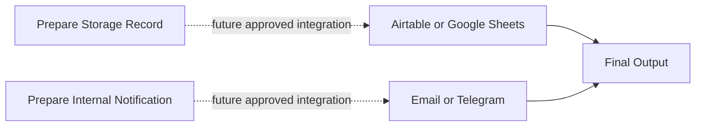

# Architecture

## Purpose

Define the proposed n8n workflow, data contracts, environment boundaries, reliability controls, and future integration points. This is a design only; no workflow has been created.

## Environment Design

| Environment | Proposed workflow name | Data | Credentials | Activation |
|---|---|---|---|---|
| DEV | `DEV - Demo Sales Company - Lead Qualification Practice` | Dummy or sanitized | Test-only, least privilege | Inactive except controlled manual tests |
| STAGING | `STAGING - Demo Sales Company - Lead Qualification Practice` | Optional; dummy/sanitized by default | Separate non-production | Only if approved and justified |
| PROD | `PROD - Demo Sales Company - Lead Qualification` | Approved minimum necessary data | Separate production credentials | Explicit approval and authorized operator only |

## Proposed Workflow Architecture

```mermaid
flowchart LR
    A["Manual Trigger"] --> B["Set Sample Lead"]
    B --> C["Normalize Input"]
    C --> D["Validate Required Fields"]
    D --> E["Calculate Lead Score"]
    E --> F["Assign Qualification Status"]
    F --> G["Prepare Storage Record"]
    G --> H["Prepare Internal Notification"]
    H --> I["Final Output"]
```



Future integrations would be added after the preparation nodes:



## Node Responsibilities

| Order | Node | Proposed type | Responsibility | Failure behavior |
|---|---|---|---|---|
| 1 | Manual Trigger | Manual Trigger | Start controlled DEV execution. | No automatic retry. |
| 2 | Set Sample Lead | Edit Fields (Set) | Supply one dummy fixture. | Stop if fixture is structurally unusable. |
| 3 | Normalize Input | Code or Edit Fields | Normalize strings, enums, booleans, email, phone, and timestamps. | Return safe normalization errors. |
| 4 | Validate Required Fields | Code | Produce validity, missing fields, and validation errors. | Continue with `invalid` context. |
| 5 | Calculate Lead Score | Code | Apply approved `rule_version` and emit breakdown. | Score defaults must not hide rule errors; route to failure handling. |
| 6 | Assign Qualification Status | Code or Edit Fields | Apply validation-first status thresholds and proposed routing. | Use `UNASSIGNED_REVIEW_REQUIRED` if routing is unresolved. |
| 7 | Prepare Storage Record | Edit Fields | Create destination-neutral record payload; do not write. | Return payload validation errors. |
| 8 | Prepare Internal Notification | Edit Fields | Create destination-neutral message payload; do not send. | Mark `notification_required: false` where appropriate. |
| 9 | Final Output | Edit Fields | Return one consolidated audit object. | Do not claim downstream success. |

## Data Flow

| Stage | Key output |
|---|---|
| Normalized | Canonical lead fields and `normalization_warnings` |
| Validated | `is_valid`, `missing_fields`, `validation_errors` |
| Scored | `score_total`, `score_breakdown`, `rule_version`, `score_reasons` |
| Classified | `lead_status`, `assignment_target`, `assignment_reason` |
| Storage-ready | Destination-neutral field map and idempotency key |
| Notification-ready | Channel-neutral subject/title, message, priority, recipient role |
| Final | All above plus `processed_at`, environment, and workflow version |

## Proposed Final Output Shape

```json
{
  "environment": "DEV",
  "workflow_version": "v0.1.0",
  "rule_version": "score-v0.1-draft",
  "lead": {
    "lead_id": "TEST-LEAD-001",
    "full_name": "Jordan Test",
    "email": "jordan@example.test",
    "company": "Example Demo Co"
  },
  "validation": {
    "is_valid": true,
    "missing_fields": [],
    "validation_errors": []
  },
  "qualification": {
    "score_total": 0,
    "score_breakdown": {},
    "lead_status": "planned-rule-not-executed"
  },
  "routing": {
    "assignment_target": "UNASSIGNED_REVIEW_REQUIRED"
  },
  "storage_record": {},
  "internal_notification": {},
  "processed_at": "YYYY-MM-DDTHH:mm:ss.sssZ"
}
```

This example is a schema illustration, not an execution result.

## Reliability Design

- Validation occurs before classification.
- Use a stable lead identifier or normalized-email-based idempotency key only after business approval.
- Future storage should use an upsert or duplicate check.
- Future notification retries must not repeat storage writes.
- Retries must be bounded and limited to transient integration failures.
- Invalid input should produce a controlled final result.
- Partial failures must record which side effect succeeded.
- A separate error workflow or equivalent alert path is recommended before production.

## Security and Privacy

- Use minimum necessary fields.
- Keep secrets only in n8n credentials; documentation contains names and placeholders only.
- Mask or omit personal data from alerts and long-lived logs.
- Configure execution-data retention by environment.
- Restrict PROD access and keep credentials separate from DEV and STAGING.

## Observability

- Proposed metadata: correlation ID, lead ID, workflow version, rule version, environment, status, processing timestamp, and safe error code.
- Monitor invalid-rate spikes, qualification distribution changes, failures, duplicates, unassigned leads, and notification/storage divergence.
- Owners and alert thresholds remain to be confirmed.

## Architecture Decisions Pending

| Decision | Status |
|---|---|
| Airtable versus Google Sheets | pending |
| Email versus Telegram | pending |
| Scoring weights and thresholds | pending approval |
| Routing method and fallback owner | pending |
| Duplicate key and merge behavior | pending |
| Optional STAGING requirement | pending |
| Retention and execution logging | pending |

## Related Notes

- [[Requirements]]
- [[Development Plan]]
- [[Test Plan]]
- [[Credentials Checklist]]
- [[Backup and Restore]]

