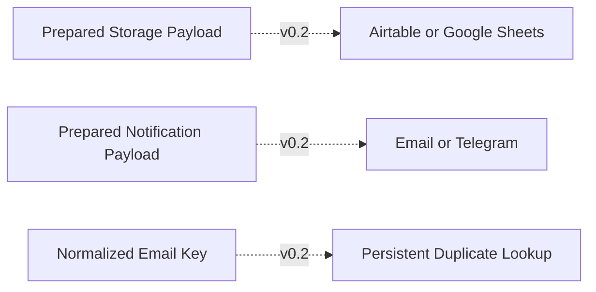

# Architecture

## Purpose

Define the implemented inactive DEV demo workflow, data contracts, environment boundaries, reliability controls, and future integration points. This architecture is accepted for the controlled practice demo only; it is not a production architecture.

## Environment Design

| Environment | v0.1 status | Workflow name | Data | Credentials |
|---|---|---|---|---|
| DEV | Demo complete, inactive | `DEV - Demo Sales Company - Lead Qualification Practice - v0.1` | Dummy only | None |
| STAGING | Not used | Not applicable | None | None |
| PROD | Not used | Not applicable | None | None |

## Implemented Demo Workflow Architecture

```mermaid
flowchart LR
    A["Manual Trigger"] --> B["Set Sample Lead"]
    B --> C["Normalize Input"]
    C --> D["Validate Required Fields"]
    D --> E["Generate Identity Hash — Crypto v2"]
    E --> F["Calculate Lead Score"]
    F --> G["Assign Qualification Status and Routing"]
    G --> H["Prepare Storage Record"]
    H --> I["Prepare Internal Notification"]
    I --> J["Final Output"]
```



The v0.1 graph is linear and contains exactly ten nodes. IF, Switch, and Merge are not used.

The following is explicitly deferred to v0.2 and is not part of the v0.1 graph:



## Node Responsibilities

| Order | Node | Implemented type | Responsibility | Failure behavior |
|---|---|---|---|---|
| 1 | Manual Trigger | Manual Trigger | Start controlled DEV execution. | No automatic retry. |
| 2 | Set Sample Lead | Edit Fields (Set) | Supply one complete dummy fixture using the approved input contract. | Stop only for an unexpected node exception. |
| 3 | Normalize Input | Code | Build the 12-key normalized object, canonical raw-input representation, and ordered normalization warnings. | Invalid normalized fields become `null`; raw invalid values remain available only for fallback hashing and safe validation evidence. |
| 4 | Validate Required Fields | Code | Apply every required-field, type, format, enum, range, consent, and timestamp rule, then prepare the approved valid or fallback hash input. | Continue with complete invalid context. |
| 5 | Generate Identity Hash | Crypto v2 | Generate the SHA-256 `idempotency_key` as a lowercase 64-character hexadecimal value, without credentials or network requests. | An unexpected hashing exception stops the manual DEV execution. |
| 6 | Calculate Lead Score | Code | Derive `lead_id` from the hash, score valid leads, and emit exact reason codes; invalid leads receive `null`. | Unexpected exception stops the DEV execution. |
| 7 | Assign Qualification Status and Routing | Code | Assign status, queue, assignment reason, and human-review flag. | Unsupported routing uses General Sales Queue and human review. |
| 8 | Prepare Storage Record | Code | Create the inert `deferred-v0.2` / `none` payload and complete prepared record. | No write node or external destination exists. |
| 9 | Prepare Internal Notification | Code | Create the inert status-based `internal-preview` payload. | No send node or channel credential exists. |
| 10 | Final Output | Edit Fields | Return one consolidated audit object. | Do not claim downstream success. |

## Data Flow

| Stage | Key output |
|---|---|
| Normalized | Canonical input fields, canonical raw-input representation, and `normalization_warnings` |
| Validated | `validation_status`, `validation_errors`, and the approved valid or fallback hash input |
| Identity-ready | Lowercase hexadecimal `idempotency_key` plus the derived `lead_id` |
| Scored | `score` and five reason codes, or `null` plus invalid-input reason |
| Classified | `qualification_status`, `assigned_queue`, `assignment_reason`, and `needs_human_review` |
| Storage-ready | `destination: deferred-v0.2`, `operation: none`, and the complete prepared record |
| Notification-ready | `channel: internal-preview` plus the exact status-based preview fields |
| Final | The exact final output contract below |

## Final Output Contract

Required top-level keys and types:

| Key | Type |
|---|---|
| `lead_id` | string |
| `idempotency_key` | string |
| `normalized_lead` | object containing all 12 input keys; invalid or missing values are `null` |
| `validation_status` | `valid` or `invalid` |
| `validation_errors` | array of `{field, code, message}` |
| `normalization_warnings` | array of `{field, code}` |
| `score` | number from 0–100 for valid leads; `null` for invalid |
| `score_reasons` | array of machine-readable strings |
| `qualification_status` | `qualified`, `nurture`, `unqualified`, or `invalid` |
| `assigned_queue` | approved queue string |
| `assignment_reason` | machine-readable string |
| `needs_human_review` | Boolean |
| `storage_payload` | object |
| `notification_payload` | object |
| `processed_at` | canonical ISO-8601 UTC string |
| `workflow_version` | `v0.1.0` |

The following is the authoritative qualified-output example. It assumes an injected fixed clock of `2026-07-23T12:00:01.000Z` for documentation and testing:

```json
{
  "lead_id": "lead_9d496fb34cf92660",
  "idempotency_key": "9d496fb34cf92660ac93d1de30328c4bef2417dc3cabc7c7ba54eddfc160956c",
  "normalized_lead": {
    "full_name": "Alex Rivera",
    "email": "alex.rivera@acme.example",
    "company": "Acme Demo Company",
    "role": "owner",
    "budget_usd": 5000,
    "timeframe_days": 30,
    "product_interest": "automation",
    "region": "APAC",
    "message": "We need workflow automation for sales reporting operations.",
    "consent": true,
    "source": "referral",
    "submitted_at": "2026-07-23T12:00:00.000Z"
  },
  "validation_status": "valid",
  "validation_errors": [],
  "normalization_warnings": [],
  "score": 100,
  "score_reasons": ["ROLE_SENIOR_25","BUDGET_5000_PLUS_25","TIMEFRAME_1_30_20","NEED_CLEAR_20","BUSINESS_EMAIL_10"],
  "qualification_status": "qualified",
  "assigned_queue": "APAC Sales Queue",
  "assignment_reason": "REGION_APAC",
  "needs_human_review": false,
  "storage_payload": {
    "destination": "deferred-v0.2",
    "operation": "none",
    "record": {
      "lead_id": "lead_9d496fb34cf92660",
      "idempotency_key": "9d496fb34cf92660ac93d1de30328c4bef2417dc3cabc7c7ba54eddfc160956c",
      "normalized_lead": {
        "full_name": "Alex Rivera",
        "email": "alex.rivera@acme.example",
        "company": "Acme Demo Company",
        "role": "owner",
        "budget_usd": 5000,
        "timeframe_days": 30,
        "product_interest": "automation",
        "region": "APAC",
        "message": "We need workflow automation for sales reporting operations.",
        "consent": true,
        "source": "referral",
        "submitted_at": "2026-07-23T12:00:00.000Z"
      },
      "validation_status": "valid",
      "validation_errors": [],
      "normalization_warnings": [],
      "score": 100,
      "score_reasons": ["ROLE_SENIOR_25","BUDGET_5000_PLUS_25","TIMEFRAME_1_30_20","NEED_CLEAR_20","BUSINESS_EMAIL_10"],
      "qualification_status": "qualified",
      "assigned_queue": "APAC Sales Queue",
      "assignment_reason": "REGION_APAC",
      "needs_human_review": false,
      "processed_at": "2026-07-23T12:00:01.000Z",
      "workflow_version": "v0.1.0"
    }
  },
  "notification_payload": {
    "channel": "internal-preview",
    "notification_required": true,
    "priority": "high",
    "subject": "Lead qualified: Acme Demo Company [lead_9d496fb34cf92660]",
    "message": "Lead lead_9d496fb34cf92660 from Acme Demo Company is qualified for automation. Score: 100. Queue: APAC Sales Queue. Human review: false."
  },
  "processed_at": "2026-07-23T12:00:01.000Z",
  "workflow_version": "v0.1.0"
}
```

Without an injected fixed clock, tests validate `processed_at` as a valid canonical ISO-8601 UTC value rather than an exact timestamp. This example is the approved contract; actual Core Release Suite evidence is recorded in [[02 - Projects/Automation/Lead Qualification Practice/Test Results|Test Results]].

## Prepared Payload Contracts

`storage_payload` always contains exactly:

- `destination: deferred-v0.2`
- `operation: none`
- `record`: lead ID, idempotency key, the complete 12-key normalized lead, validation status/errors, normalization warnings, score/reasons, qualification status, queue/reason, review flag, processed timestamp, and workflow version

`notification_payload` contains:

- `channel: internal-preview`
- `notification_required`: `true` only for qualified leads or leads needing human review
- `priority`: `high` for qualified or invalid; `none` for nurture or unqualified
- `subject` and `message`: non-empty strings for qualified and invalid; `null` for nurture and unqualified

Qualified and invalid previews use:

```text
subject = "Lead <qualification_status>: <company_or_Unknown Company> [<lead_id>]"
message = "Lead <lead_id> from <company_or_Unknown Company> is <qualification_status> for <product_or_unknown>. Score: <score_or_not-scored>. Queue: <assigned_queue>. Human review: <true_or_false>."
```

The raw lead `message` is excluded from the notification payload. Formula-risk detection applies when a trimmed string begins with `=`, `+`, `-`, or `@`. Channel-markup detection applies to `<`, `>`, `&`, backticks, square brackets, asterisks, and underscores. v0.1 emits warnings but performs no destination-specific rendering.

## Reliability Design

- Validation occurs before scoring and classification.
- Invalid input returns a controlled object and skips scoring.
- Crypto v2 hashes normalized email plus normalized timestamp for valid identity inputs and the approved canonical raw-input representation for missing or invalid identity inputs.
- Crypto v2 uses SHA-256 with lowercase hexadecimal output, requires no credentials, and performs no network requests.
- `idempotency_key` is generated but never looked up in v0.1.
- The graph remains linear; IF, Switch, and Merge are excluded from v0.1.
- Unexpected Code-node exceptions stop the manual execution; v0.1 has no automatic retries.
- Destination and channel escape flags identify dangerous leading spreadsheet characters or markup.
- Historical lookup, side-effect idempotency, retries, concurrency, partial-failure recovery, and error workflows are v0.2 concerns.

## Security and Privacy

- Dummy data only and no credentials.
- The notification payload omits the raw lead message.
- DEV execution logs are retained for seven days.
- No STAGING, PROD, external destination, or real client data is used.

## Observability

- Record manual execution ID, lead ID, workflow version, status, processing duration, and safe error codes.
- Review invalid results, fallback routing, warning flags, and executions over two seconds.
- Project Owner and Automation Engineer perform the operational review.

## Deferred v0.2 Architecture

- Airtable or Google Sheets adapter and historical duplicate lookup.
- Email or Telegram adapter.
- Persistent idempotency, upsert, concurrency, external retries, timeouts, partial-failure recovery, reconciliation, and error alerts.
- Any STAGING or PROD topology and production-safe lead identifier.

## Release Boundary

The ten-node architecture and complete output contract are ready for an inactive, dummy-data-only DEV demonstration. Production readiness is not approved. Operational review, recovery evidence, client/owner approval, the Extended Regression Suite when required, integration testing, and production smoke testing remain prerequisites for any future live deployment.

## Related Notes

- [[02 - Projects/Automation/Lead Qualification Practice/Requirements|Requirements]]
- [[02 - Projects/Automation/Lead Qualification Practice/Development Plan|Development Plan]]
- [[02 - Projects/Automation/Lead Qualification Practice/Test Plan|Test Plan]]
- [[02 - Projects/Automation/Lead Qualification Practice/Credentials Checklist|Credentials Checklist]]
- [[02 - Projects/Automation/Lead Qualification Practice/Backup and Restore|Backup and Restore]]
