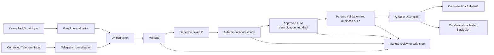

# Architecture

## Status

Proposed design only. No n8n workflow, credentials, triggers, records, tasks, or alerts have been created.

## Environment Design

| Environment | Workflow name                                                | Data                                  | Credentials  | Active               |
| ----------- | ------------------------------------------------------------ | ------------------------------------- | ------------ | -------------------- |
| DEV         | `DEV - SupportFlow AI - Gmail and Telegram Ticketing System` | Dummy or sanitized                    | Not approved | No; workflow unbuilt |
| STAGING     | Not Yet Defined                                              | Not Yet Defined                       | Not approved | No                   |
| PROD        | Not approved                                                 | Real data prohibited in current scope | Not approved | No                   |

## System Context

## Proposed Logical Stages

| Order | Stage | Responsibility | Safe failure behavior |
|---|---|---|---|
| 1 | Gmail intake | Receive approved Gmail fixture | Stop; no downstream effect |
| 2 | Telegram intake | Receive approved Telegram fixture | Stop; no downstream effect |
| 3 | Channel normalization | Map source data to unified fields | Return normalization error |
| 4 | Validation | Enforce required fields, types, and limits | Invalid result; no side effects |
| 5 | Ticket identity | Generate approved ticket ID and idempotency data | Stop if identity is unsafe |
| 6 | Duplicate lookup | Query approved Airtable keys/window | Fail closed if unknown |
| 7 | AI classification | Produce constrained classification and draft | Bounded retry or manual review |
| 8 | Rule enforcement | Validate schema and apply deterministic overrides | Manual review |
| 9 | Ticket storage | Create one valid new DEV ticket | Stop downstream if write fails |
| 10 | Task creation | Create one controlled task | Record failure; prevent duplicate replay |
| 11 | Alert routing | Alert only on approved escalation conditions | Record failure; no customer contact |
| 12 | Audit summary | Return sanitized processing result | Preserve recoverable context |

Exact n8n nodes, versions, settings, credentials, connections, and failure workflow are **Not Yet Defined** and require a later read-only audit plus architecture approval.

## Branch Contracts

- Both channel branches must emit the same unified field names and data types.
- Validation must converge before identity, duplicate, AI, storage, task, or alert operations.
- Only one logical item may reach each side-effect stage for one valid new request.
- Duplicate, invalid, or manual-review control items must be excluded from downstream creation.
- Stored ticket identity must be available before task or alert actions.

## Reliability and Security Controls

- Input validation: exact contract pending approval.
- Idempotency and duplicate prevention: fail closed; keys/window pending approval.
- AI safety: constrained JSON schema, enum validation, deterministic overrides, and manual fallback.
- Retry and timeout policy: Not Yet Defined.
- Concurrency and replay locking: Not Yet Defined.
- Partial-failure recovery: Not Yet Defined.
- Execution-data retention: Not Yet Defined.
- Data minimization: only fields needed for the approved demo.
- Secrets: credential references only; no values in Obsidian or Git.
- Customer communication: no reply node or automatic send path.

## Architecture Decisions

| ID | Decision | Status |
|---|---|---|
| AD-001 | One canonical ticket contract after channel-specific normalization | proposed |
| AD-002 | Validate before any lookup, AI call, write, task, or alert | proposed |
| AD-003 | Deterministic rules override AI suggestions | proposed |
| AD-004 | Store the ticket before creating task or alert effects | proposed |
| AD-005 | Fail closed when duplicate status is unknown | proposed |
| AD-006 | Keep customer response as an unsent reviewable draft | confirmed constraint |
| AD-007 | Use one workflow or multiple intake workflows | Not Yet Defined |
| AD-008 | Shared error workflow and notification pattern | Not Yet Defined |

## Approval

- Reviewer: Mervin
- Approval status: Not Yet Defined
- Approval date: Not Yet Defined
- Build authorized: no

## Related Notes

- [[02 - Projects/Automation/SupportFlow AI - Gmail and Telegram Ticketing System/Requirements|Requirements]]
- [[02 - Projects/Automation/SupportFlow AI - Gmail and Telegram Ticketing System/Data Model|Data Model]]
- [[02 - Projects/Automation/SupportFlow AI - Gmail and Telegram Ticketing System/Implementation Plan|Implementation Plan]]
