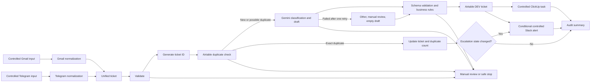

# Architecture

## Status

Implemented and validated architecture for the credential-free Phase 1 skeleton. Workflow `cyiCqsjLQdB7apjP` is inactive and contains no credentials, live triggers, external-service nodes, records, tasks, sends, or alerts.

## Phase 1 System Context

```mermaid
flowchart LR
    M["Manual Trigger"] --> F["Dummy Gmail and Telegram payloads"]
    F --> N["Channel normalization"]
    N --> U["Unified ticket"]
    U --> V["Required-field validation"]
    V --> I["Ticket ID and content fingerprint"]
    I --> D["Mock duplicate result"]
    D --> AI["Mock structured AI result and draft"]
    AI --> R["Deterministic business rules"]
    R --> O["Final structured output"]
```

No node in this boundary may call Gmail, Telegram, Airtable, ClickUp, Slack, Gemini, or another external service.

## Environment Design

| Environment | Workflow name                                                | Data                                  | Credentials  | Active               |
| ----------- | ------------------------------------------------------------ | ------------------------------------- | ------------ | -------------------- |
| DEV         | `DEV - SupportFlow AI - Gmail and Telegram Ticketing System` | Dummy or sanitized                    | None         | No; built and inactive |
| STAGING     | Not Yet Defined                                              | Not Yet Defined                       | Not approved | No                   |
| PROD        | Not approved                                                 | Real data prohibited in current scope | Not approved | No                   |

## Deferred Integration Context

## Proposed Logical Stages

| Order | Stage | Responsibility | Safe failure behavior |
|---|---|---|---|
| 1 | Gmail intake | Receive approved Gmail fixture | Stop; no downstream effect |
| 2 | Telegram intake | Receive approved Telegram fixture | Stop; no downstream effect |
| 3 | Channel normalization | Map source data to unified fields | Return normalization error |
| 4 | Validation | Enforce required fields, types, and limits | Invalid result; no side effects |
| 5 | Ticket identity | Generate approved ticket ID and idempotency data | Stop if identity is unsafe |
| 6 | Duplicate lookup | Exact identity plus 72-hour content fingerprint in a 30-day lookback | Fail closed if unknown |
| 7 | AI classification | Produce constrained structured-JSON classification and draft through Gemini | One retry, then approved safe fallback |
| 8 | Rule enforcement | Validate schema and apply deterministic overrides | Manual review |
| 9 | Ticket storage | Create one valid new DEV ticket | Stop downstream if write fails |
| 10 | Task creation | Create one controlled task | Record failure; prevent duplicate replay |
| 11 | Alert routing | Alert only on approved escalation conditions | Record failure; no customer contact |
| 12 | Audit summary | Return sanitized processing result | Preserve recoverable context |

Exact integration nodes, credentials, external connections, and failure-workflow design remain **Not Yet Defined**. The Phase 1 credential-free node sequence is recorded below.

## Implemented Phase 1 Node Sequence

| Order | Node name | Type | Version |
|---|---|---|---|
| 1 | Manual Trigger | `n8n-nodes-base.manualTrigger` | 1 |
| 2 | Set Sample Gmail Payloads | `n8n-nodes-base.set` | 3.4 |
| 3 | Set Sample Telegram Payloads | `n8n-nodes-base.set` | 3.4 |
| 4 | Normalize Selected Channel | `n8n-nodes-base.code` | 2 |
| 5 | Build Unified Ticket | `n8n-nodes-base.code` | 2 |
| 6 | Validate Required Fields | `n8n-nodes-base.code` | 2 |
| 7 | Generate Ticket UUID | `n8n-nodes-base.crypto` | 2 |
| 8 | Format Ticket ID and Fingerprint Input | `n8n-nodes-base.code` | 2 |
| 9 | Generate Content Fingerprint | `n8n-nodes-base.crypto` | 2 |
| 10 | Set Mock Duplicate Result | `n8n-nodes-base.code` | 2 |
| 11 | Set Mock AI Classification | `n8n-nodes-base.code` | 2 |
| 12 | Set Mock Draft Response | `n8n-nodes-base.code` | 2 |
| 13 | Apply Deterministic Business Rules | `n8n-nodes-base.code` | 2 |
| 14 | Final Structured Output | `n8n-nodes-base.set` | 3.4 |

## Approved Phase 1 Stages

| Order | Stage | Phase 1 behavior |
|---|---|---|
| 1 | Manual Trigger | Starts only an approved fixture run |
| 2 | Dummy payload selection | Uses `SF-FX-001` through `SF-FX-006` |
| 3 | Channel normalization | Produces the unified ticket contract |
| 4 | Validation | Fails closed on invalid required fields |
| 5 | Identity | Generates `SF-YYYYMMDD-XXXXXXXX` and SHA-256 fingerprint |
| 6 | Mock duplicate | Emits controlled `new`, `exact_duplicate`, or `possible_duplicate` results |
| 7 | Mock AI | Emits approved structured classification and unsent draft fields |
| 8 | Deterministic rules | Overrides AI and applies the approved priority examples |
| 9 | Final output | Returns one audit-friendly structured result with no side effects |

## Branch Contracts

- Both channel branches must emit the same unified field names and data types.
- Validation must converge before identity, duplicate, AI, storage, task, or alert operations.
- Only one logical item may reach each side-effect stage for one valid new request.
- Exact duplicates update the existing Airtable record and never create another ClickUp task.
- Exact duplicates alert again only when the final escalation state changes.
- Content duplicates continue as `possible_duplicate` records with candidate references and human review.
- Invalid control items are excluded from downstream creation.
- Stored ticket identity must be available before task or alert actions.

## Reliability and Security Controls

- Input validation: approved strict allowlist and required-field contract with a 5,000-character limit.
- Idempotency and duplicate prevention: exact source identity, 72-hour content fingerprint, 30-day lookup, and fail-closed unknown state.
- AI safety: Google Gemini free tier only, constrained JSON schema, enum validation, deterministic overrides, one retry, and approved safe fallback.
- Retry and timeout policy: read-only API calls use at most two retries with 2-second and 5-second backoff; default API timeout is 15 seconds. Phase 1 makes no API calls.
- Concurrency: Phase 1 fixture tests run sequentially. Production-grade locking is deferred.
- Create retries: never blind; re-check ticket ID or dedupe key first. Phase 1 performs no creates.
- Persistent failures: stop downstream processing and record an operational error when storage exists; Phase 1 returns the error in final output.
- Execution-data retention: seven days; DEV integration test artifacts: 30 days.
- Data minimization: only fields needed for the approved demo.
- Secrets: credential references only; no values in Obsidian or Git.
- Customer communication: no reply node or automatic send path.

## Architecture Decisions

| ID | Decision | Status |
|---|---|---|
| AD-001 | One canonical ticket contract after channel-specific normalization | approved |
| AD-002 | Validate before any lookup, AI call, write, task, or alert | approved |
| AD-003 | Deterministic rules override AI suggestions | approved |
| AD-004 | Store the ticket before creating task or alert effects | approved |
| AD-005 | Fail closed when duplicate status is unknown | approved |
| AD-006 | Keep customer response as an unsent reviewable draft | confirmed constraint |
| AD-007 | One inactive DEV workflow with two controlled intake branches | approved design boundary |
| AD-008 | Shared error workflow and notification pattern | Not Yet Defined |
| AD-009 | One Airtable `Tickets` table | approved |
| AD-010 | Exact duplicates update existing records; content duplicates remain reviewable tickets | approved |
| AD-011 | AI failure uses the approved non-escalating fallback | approved |
| AD-012 | Ticket ID uses `SF-YYYYMMDD-XXXXXXXX` with UUID v4 suffix | approved |
| AD-013 | Fingerprint uses approved NFKC normalization and SHA-256 contract | approved |
| AD-014 | Phase 1 uses mocked duplicate and AI results only | approved |
| AD-015 | Phase 1 contains no credentials, connections, side effects, or activation | approved |
| AD-016 | Google Gemini replaces OpenAI as the only approved DEV LLM provider | approved |
| AD-017 | Schema version is exactly `0.1.0` | approved |
| AD-018 | Fingerprint components use the literal `\u001F` separator | approved |
| AD-019 | Gmail trigger is read-only and Telegram accepts new-message updates only | approved and node-compatible; configuration pending |

## Reserved DEV Resource Names

- Airtable base: `DEV - SupportFlow AI`
- Airtable table: `Tickets`
- ClickUp list: `DEV - SupportFlow AI - Ticket Queue`
- ClickUp assignee: Mervin
- Slack channel: `#dev-supportflow-alerts`
- Gmail mailbox: Dedicated DEV mailbox — Not Yet Assigned
- Telegram bot and chat: Dedicated DEV bot and private DEV chat — Not Yet Assigned
- Gemini project: Dedicated DEV Google AI Studio or Google Cloud project — Not Yet Assigned

These names do not confirm that resources exist. Actual IDs and credentials are Not Yet Assigned and are prohibited in Phase 1.

## Approved Operational Defaults

- Capacity: 100 tickets per day; peak 10 per five minutes.
- Gemini: maximum 500 free-tier calls per review cycle; paid use prohibited without separate approval.
- Airtable: maximum 100 created DEV test records per review cycle.
- ClickUp: maximum 100 created DEV tasks per review cycle.
- Slack: maximum 30 DEV alerts per review cycle.
- Recovery: RTO four hours, RPO 24 hours, validated export, manual replay.
- Ownership: Mervin for the portfolio phase.
- Slack and ClickUp remain controlled DEV side effects requiring later resource and credential approval.

## Approved Trigger Boundaries

- Gmail Trigger: dedicated DEV mailbox, dummy/sanitized messages, approved label or search filter, read-only access, no send, draft, modification, label mutation, deletion, or attachment-content download.
- Telegram Trigger: dedicated DEV bot, one private DEV chat, dummy new-message updates only, no edited/outbound messages, file downloads, attachment contents, admin permissions, or production chats.
- Trigger node operation/version, polling or webhook behavior, activation requirements, lookback/pending-update handling, filtering, pagination, mapping, and idempotency must be verified in the credential-free compatibility audit.
- No trigger may be added, connected, registered, executed, or activated under the current authorization.

## Phase 2 Credential-Free Compatibility Findings

- Airtable 2.2 supports schema read, record search, create, update, and upsert with `airtableTokenApi` or `airtableOAuth2Api`.
- Gemini is available as Google Gemini 1.2 and as Google Gemini Chat Model 1.1. A Basic LLM Chain 1.9 plus Structured Output Parser 1.3 provides explicit JSON Schema validation; automatic parser repair must remain disabled because it would add an uncounted LLM call.
- The direct Google Gemini 1.2 text node supports JSON output, but its built-in Google Search, URL Context, and Code Execution controls must all be explicitly false.
- ClickUp 1 supports task lookup/create/update and custom fields with `clickUpOAuth2Api` or `clickUpApi`.
- Slack 2.5 supports controlled message posting with `slackOAuth2Api` or `slackApi`.
- Gmail Trigger 1.4 is polling-based, supports label/query filters, full message bodies with `simple=false`, and attachment download disabled.
- Telegram Trigger 1.3 is webhook-based. Registration calls Telegram `setWebhook`, allows only one trigger per bot, and drops pending updates at this node version; test or production registration is an external mutation and is not approved.
- Native integration-node parameter definitions do not expose the approved 15-second API timeout. Exact 2-second then 5-second backoff also requires explicit orchestration rather than one fixed node retry setting.
- The connected MCP does not expose the exact n8n application build number; compatibility is evidenced by the installed node catalog and successful schema-only validation.

### Completed Pre-Connection Migration

The saved inactive Phase 1 workflow now uses `schema_version: 0.1.0`; `source_event_id`, `source_message_id`, `source_conversation_id`, and `source_parent_message_id`; and SHA-256 of normalized sender reference, subject, and message text joined with U+001F. Executions `7113`–`7118` reran only `SF-FX-001` through `SF-FX-006` and passed 6 of 6. Gemini and every external integration remain mocked, credential-free, and disconnected.

## Approval

- Reviewer: Mervin
- Approval status: approved for Phase 1 boundary
- Approval date: 2026-07-25
- Build authorized: yes, Phase 1 only
- Build status: completed and manually validated; workflow remains inactive

## Related Notes

- [[02 - Projects/Automation/SupportFlow AI - Gmail and Telegram Ticketing System/Requirements|Requirements]]
- [[02 - Projects/Automation/SupportFlow AI - Gmail and Telegram Ticketing System/Data Model|Data Model]]
- [[02 - Projects/Automation/SupportFlow AI - Gmail and Telegram Ticketing System/Implementation Plan|Implementation Plan]]
