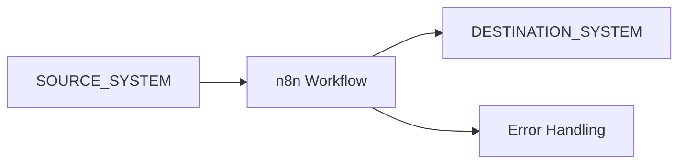

# Architecture

## Purpose

Describe the systems, environments, data flow, workflow graph, dependencies, and operational controls.

## Environment Design

| Environment | Workflow name | Data | Credential pattern | Activation owner |
|---|---|---|---|---|
| DEV | `DEV - Client or Project - Workflow Name` | Dummy or sanitized | `DEV - Service - Purpose` | Developer |
| STAGING | OPTIONAL_STAGING_NAME | Project-defined | Separate non-production | PROJECT_OWNER |
| PROD | `PROD - Client or Project - Workflow Name` | Approved minimum data | `PROD - Service - Purpose` | PROD_APPROVER |

## System Context

## Workflow Inventory

| Workflow | Environment | ID | Version | Owner | Active |
|---|---|---|---|---|---|
|  | DEV |  | v0.1.0 |  | No |

## Node and Connection Design

| Order | Node | Type | Responsibility | Failure behavior |
|---|---|---|---|---|
| 1 |  |  |  |  |

## Data Flow

| Step | Input | Transformation | Output | Destination |
|---|---|---|---|---|
|  |  |  |  |  |

## Credential References

Record names and owners only. Never record values.

| Environment | Credential name | Owner | Purpose |
|---|---|---|---|
| DEV | `DEV - Service - Purpose` |  |  |
| PROD | `PROD - Service - Purpose` |  |  |

## Reliability Design

- Input validation:
- Idempotency:
- Duplicate prevention:
- Retry and timeout behavior:
- Empty-path handling:
- Partial-failure handling:
- Error workflow and alerts:
- Manual recovery:

## Observability

- Execution-data policy:
- Success monitoring:
- Failure monitoring:
- Alert owner:
- Reconciliation method:

## Security and Client Data

- Data minimization:
- Sanitization method:
- Access boundaries:
- Retention:
- Sensitive logging controls:

## Backup and Rollback

- Backup location reference:
- Restore prerequisites:
- Rollback threshold:
- Rollback owner:

## Decisions and Open Questions

| Decision or question | Status | Owner | Rationale |
|---|---|---|---|
|  |  |  |  |

## Approval

- Reviewer:
- Approval status:
- Date:

## Related Notes

- [[Templates/Client Automation/Requirements|Requirements]]
- [[Templates/Client Automation/Development Plan|Development Plan]]
- [[03 - Areas/Automation Operations/Development and Production Policy|Development and Production Policy]]
