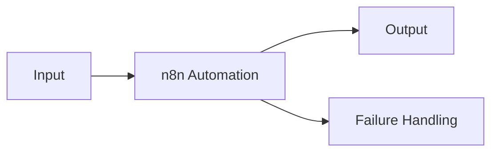

# CASE_STUDY_TITLE

## Publication Safety

- [ ] Client approved publication or anonymization.
- [ ] No secrets, credentials, private identifiers, or unredacted client data are included.
- [ ] Outcomes are supported by evidence.
- [ ] Limitations and assumptions are disclosed.
- [ ] Untested or planned work is not described as completed.

## Summary

Briefly describe the client context, automation, and verified outcome.

## Client Context

- Industry:
- Team or function:
- Client name usage: Named / Anonymous
- Confidentiality restrictions:

## Challenge

- Previous process:
- Pain points:
- Volume or frequency:
- Business impact:

## Scope

### Included

- 

### Not Included

- 

## Solution

- Workflow purpose:
- Systems connected:
- DEV and PROD separation:
- Reliability and error handling:
- Data and security controls:

## Architecture

## Delivery Process

Discovery → Requirements → Architecture → DEV build → Testing → Approval → Backup → Controlled PROD deployment → Smoke test → Handover

## Verified Results

| Metric | Baseline | Observed result | Evidence | Period |
|---|---|---|---|---|
|  |  |  |  |  |

## Reliability and Operations

- Error handling:
- Monitoring:
- Backup and rollback:
- Maintenance ownership:

## Limitations

- 

## Lessons Learned

- 

## Approval

- Client approver:
- Publication status:
- Approval date:
- Evidence reference:

## Related Notes

- [[Templates/Client Automation/Client Automation Project|Client Automation Project]]
- [[Templates/Client Automation/Test Results|Test Results]]
- [[Templates/Client Automation/Known Limitations|Known Limitations]]
- [[Templates/Client Automation/Client Handover|Client Handover]]
